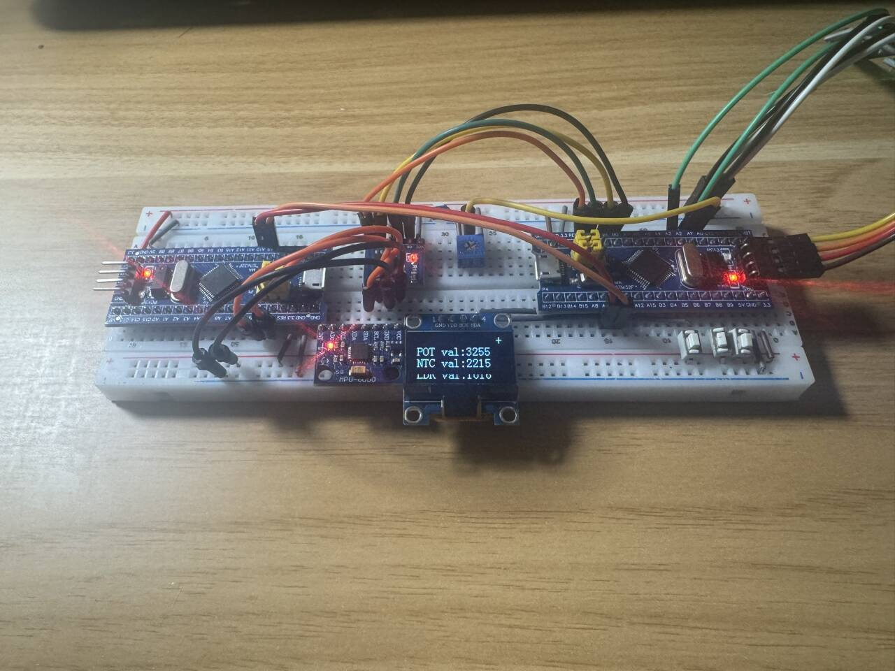

# ASC-EC-FourthCheck
## ASC智能车实验室电控组第四轮考核任务

---

### A机 - 引脚+定时器分配
#### [TIM定时器通道分配]
- `TIM1`：定时器定时中断

#### [OLED]
- 通信方式：软件I2C
- `PB6`：SCK(SCL)
- `PB7`：SDA(SDA)

#### [按键模块]
- 扫描方式：TIM1定时器定时扫描
- `PB8`：UP
- `PB9`：DOWN
- `PB5`：CONFIRM

#### [传感器模块]
- 扫描方式：带开关的TIM1定时器定时扫描
- `PA0`：POT电位器
- `PA1`：NTC热敏电阻（A0）
- `PA2`：LDR光敏电阻（A0）

#### [W25Q64存储模块]
- 通信方式：软件SPI
- `PB0`：SS
- `PB1`：SCK
- `PB10`：MISO
- `PB11`：MOSI

#### [串口模块]
- 通信方式：硬件USART1
- `PA9`：TX(USART输出)
- `PA10`：RX(USART输入)

---

### B机 - 引脚+定时器分配
#### [TIM定时器通道分配]
- `TIM1`：定时器定时中断

#### [MPU6050陀螺仪模块]
- 通信方式：软件I2C
- `PB10`：SCL
- `PB11`：SDA

#### [串口模块]
- 通信方式：硬件USART1
- `PA9`：TX(USART输出)
- `PA10`：RX(USART输入)

---

### 工程日志（并不完整）
- 2025.12.6：
  - [A机]：完成OLED模块、按键模块、菜单架构开发；实现传感器和W25Q64存储模块应用；调整按键引脚；完成B机数据和心跳包接收处理
  - [B机]：完成陀螺仪模块开发；实现MPU6050数据解算和心跳包发送
- 2025.12.7：
  - [B机]：修复Yaw轴上电后异常飘移；优化MPU6050解算数据输出
- 2025.12.14：
  - 上传考核版本（2025.12.14 15:32）
  - 查出ADC采样问题（光敏传感器数据异常），确认是单片机硬件问题

  